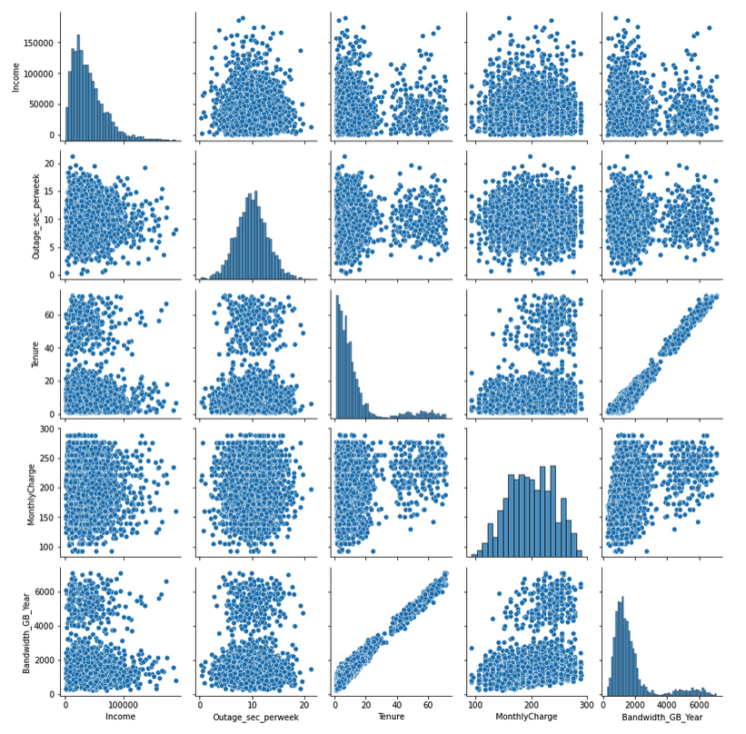
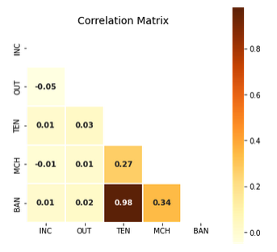
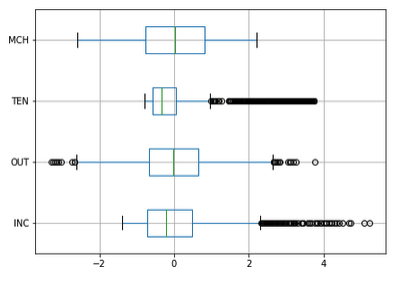
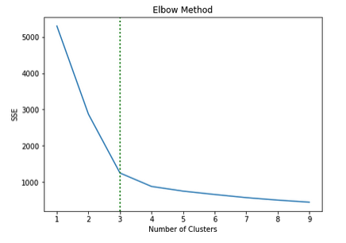
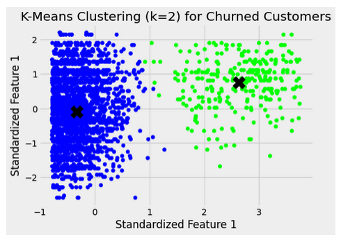
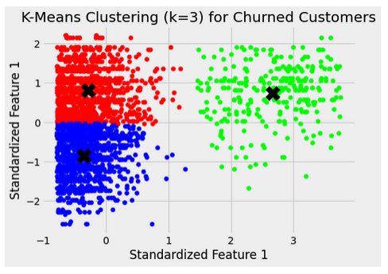
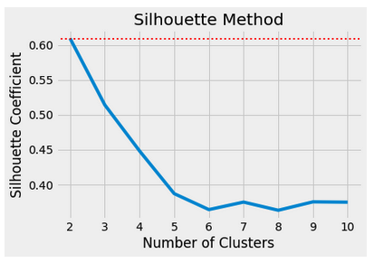
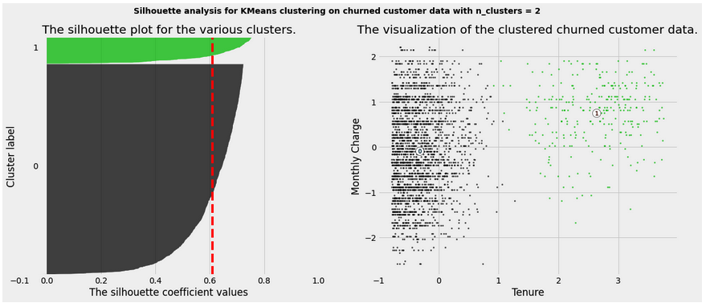
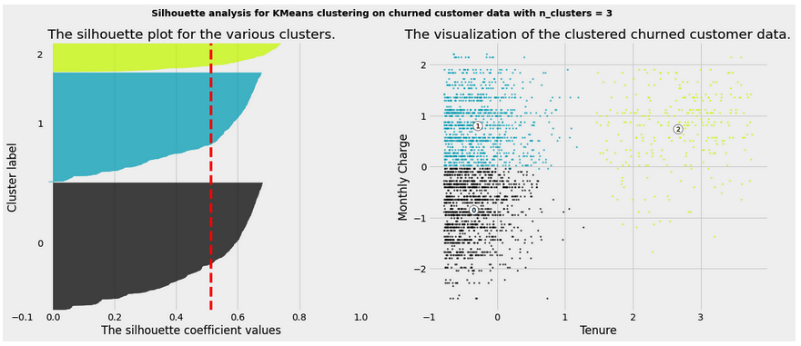
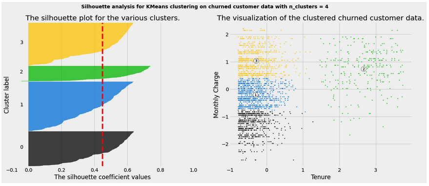

# Clustering-Analysis-With-K-Means
Clustering analysis is a technique used in machine learning and data mining to group similar data points together based on their features or attributes. The goal is to find natural groupings or clusters within the data, where data points within a cluster are more similar to each other compared to points in other clusters. One popular clustering algorithm is k-means, which is relatively simple yet effective.

How the k-means clustering algorithm works:
* Initialization: The algorithm starts by randomly selecting 'k' initial cluster centroids (points) in the feature space. The value of 'k' represents the number of clusters you want to identify in the data.
* Assignment: Each data point is then assigned to the nearest cluster centroid based on a distance metric, commonly the Euclidean distance. The distance is calculated as the squared sum of the differences between each feature of the data point and the centroid. The data point is assigned to the cluster whose centroid has the smallest distance.
* Update: After all data points have been assigned to clusters, the algorithm recalculates the centroids of each cluster by taking the mean of the feature values of all the data points in that cluster.
* Reassignment: The data points are reassigned to the nearest centroids based on the updated centroids.
* Iteration: Steps 3 and 4 are repeated iteratively until convergence. Convergence occurs when the centroids stop changing significantly, or a predefined number of iterations is reached.
* Result: The algorithm returns the final 'k' clusters, each represented by its centroid.

The main challenge in k-means is choosing the appropriate value of 'k.' There are various techniques to determine the optimal number of clusters, such as the Elbow method or the Silhouette score, which assess the quality of the clustering solution. K-means is a popular choice for clustering analysis due to its simplicity, efficiency, and scalability. However, it has some limitations, such as its sensitivity to the initial random centroids and its tendency to converge to local optima. To mitigate these issues, k-means is often run multiple times with different initializations, and the best clustering solution is chosen based on an evaluation metric.

### Environment
* Python 3
* Jupyter Notebook

### Libraries
* Pandas
* Numpy
* Scipy
* Matplotlib
* Seaborn
* Sci-kit Learn
* Kneed

### Data Exploration
A pair plot is created to compare all features and their distributions.

A correlation matrix is created to identify highly correlated features.

A scatter plot of the customers who churned to see the distribution in relation to tenure.

A boxplot helps to find outlying data in the features.

### Analysis
To determine the number of clusters needed for the K-Means analysis, two methods are deployed and compared. 
The elbow method plots the explained variation as a function of the number of clusters and picks the elbow of the curve as the number of clusters to use for the analysis.

K-Means is processed from the elbow method using 2 clusters and then again using 3 clusters to compare. The results are plotted on a scatter plot.

The silhouette method calculates the silhouette index for each sample, average silhouette index for each cluster and the overall average silhouette index for the data. This method calculates the separation distance between the resulting clusters, makling it a more reliable analysis method.

Using the silhouette method, the K-Means analysis is processed using 2, 3 and 4 clusters and plotted for analysis with the average silhouette score plotted in red. 

### Results
The K-Means analysis showed definite clusters of data points in the analysis. These clusters are highly concentrated, showing that the data points all have a small Euclidian distance from the centroid of the cluster. This suggests that the model is accurate and representative of the data. The variables determined to impact the churned customers in the greatest manner are monthly charge and tenure. The higher the monthly charge and the lower tenure values, equate to the customer discontinuing the service with the provider. 

### Limitations 
A limitation of the analysis was determining the number of clusters that was best for the analysis. There are two methods that are used in this analysis, and they differ in their results. Diving further into the silhouette method and obtaining the coefficients and creating the silhouette analysis helped to clarify the optimal number of clusters. 

### Recommendations 
The results of the K-Means analysis showed that a high monthly charge early into a customer’s service is the main factors for their decision to leave the provider. Creating a marketing campaign to target these customers and offer them a discount incentive for remaining with the service would increase the chance of retaining the customer.
