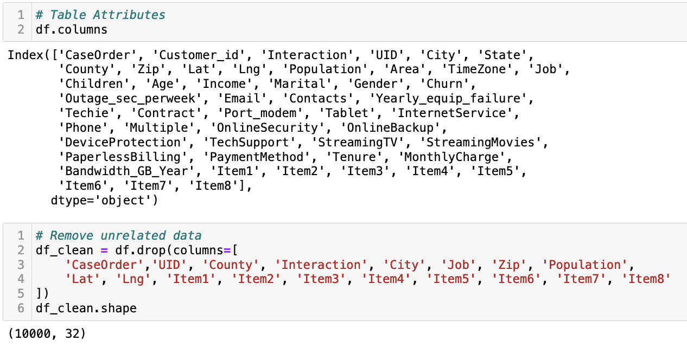
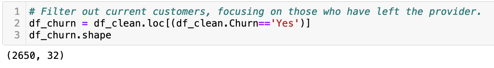
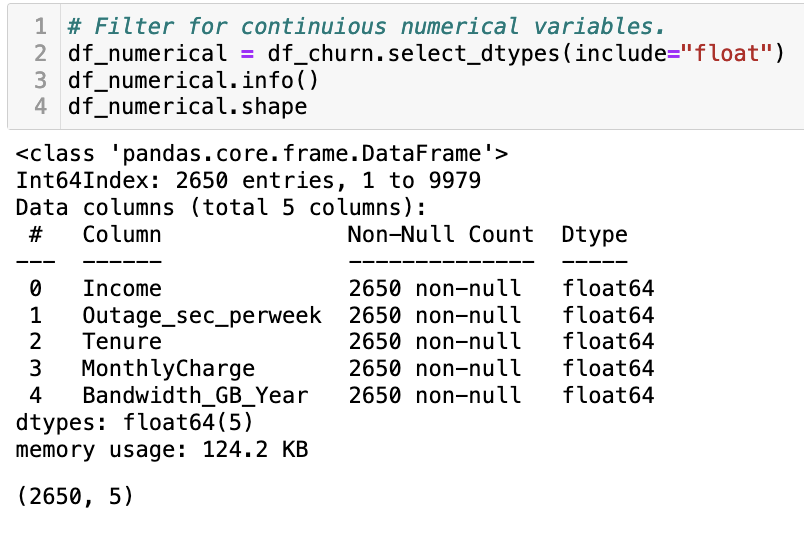

# Clustering-Analysis-With-K-Means
Clustering analysis is a technique used in machine learning and data mining to group similar data points together based on their features or attributes. The goal is to find natural groupings or clusters within the data, where data points within a cluster are more similar to each other compared to points in other clusters. One popular clustering algorithm is k-means, which is relatively simple yet effective.

How the k-means clustering algorithm works:
* Initialization: The algorithm starts by randomly selecting 'k' initial cluster centroids (points) in the feature space. The value of 'k' represents the number of clusters you want to identify in the data.
* Assignment: Each data point is then assigned to the nearest cluster centroid based on a distance metric, commonly the Euclidean distance. The distance is calculated as the squared sum of the differences between each feature of the data point and the centroid. The data point is assigned to the cluster whose centroid has the smallest distance.
* Update: After all data points have been assigned to clusters, the algorithm recalculates the centroids of each cluster by taking the mean of the feature values of all the data points in that cluster.
* Reassignment: The data points are reassigned to the nearest centroids based on the updated centroids.
* Iteration: Steps 3 and 4 are repeated iteratively until convergence. Convergence occurs when the centroids stop changing significantly, or a predefined number of iterations is reached.
* Result: The algorithm returns the final 'k' clusters, each represented by its centroid.

The main challenge in k-means is choosing the appropriate value of 'k.' There are various techniques to determine the optimal number of clusters, such as the Elbow method or the Silhouette score, which assess the quality of the clustering solution. K-means is a popular choice for clustering analysis due to its simplicity, efficiency, and scalability. However, it has some limitations, such as its sensitivity to the initial random centroids and its tendency to converge to local optima. To mitigate these issues, k-means is often run multiple times with different initializations, and the best clustering solution is chosen based on an evaluation metric.

### Environment
* Python 3
* Jupyter Notebook

### Libraries
* Pandas
* Numpy
* Scipy
* Matplotlib
* Seaborn
* Sci-kit Learn
* Kneed

### Data Ingestion
The data is read into the Jupyter Notebook using Pandas read_csv() method.
```
df = pd.read_csv('churn.csv')
```

### Data Cleaning
The dataframe is fairly clean already and just needs some minor manipulation to get it ready for analysis. Using the columns command, the attributes are observed and the drop() method is used to eliminate those that are not needed.


Using the loc() method, the customers who have churned from the provider are isolated. The dataframe now consists of 2650 rows of customer data and 32 attributes. 


With the select_dtypes() method, the continuous numerical variables are found and evaluated.


